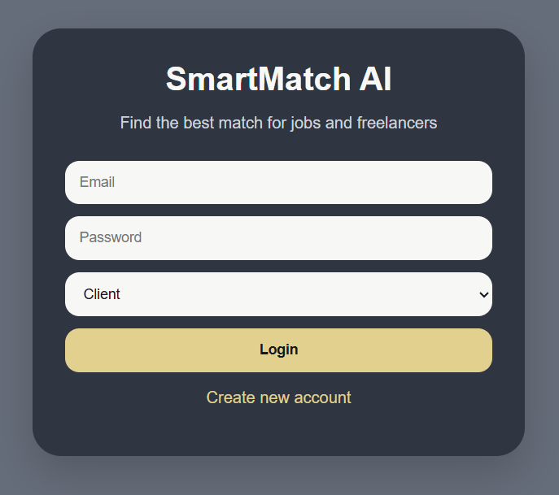
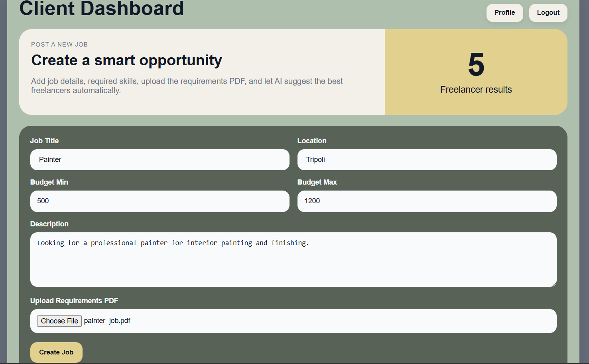
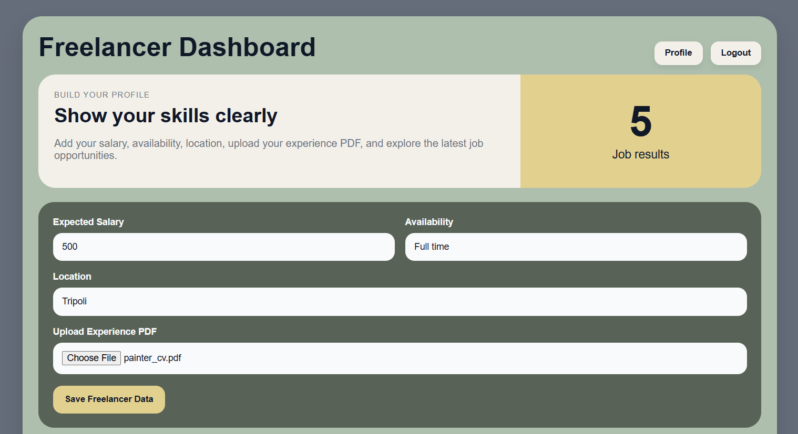
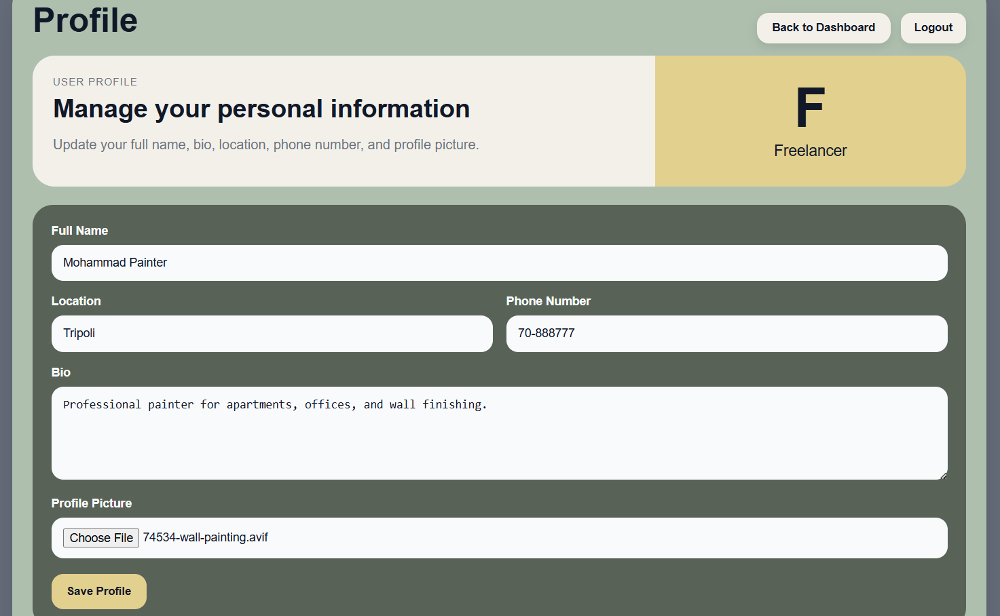
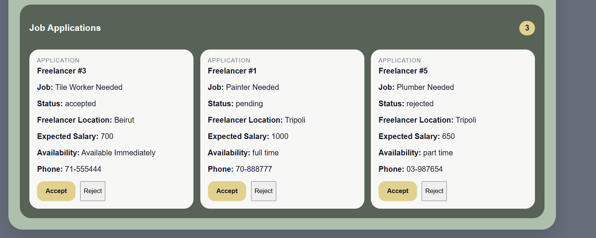
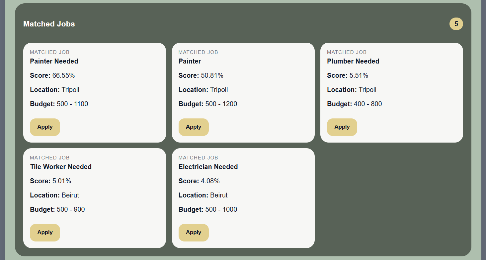
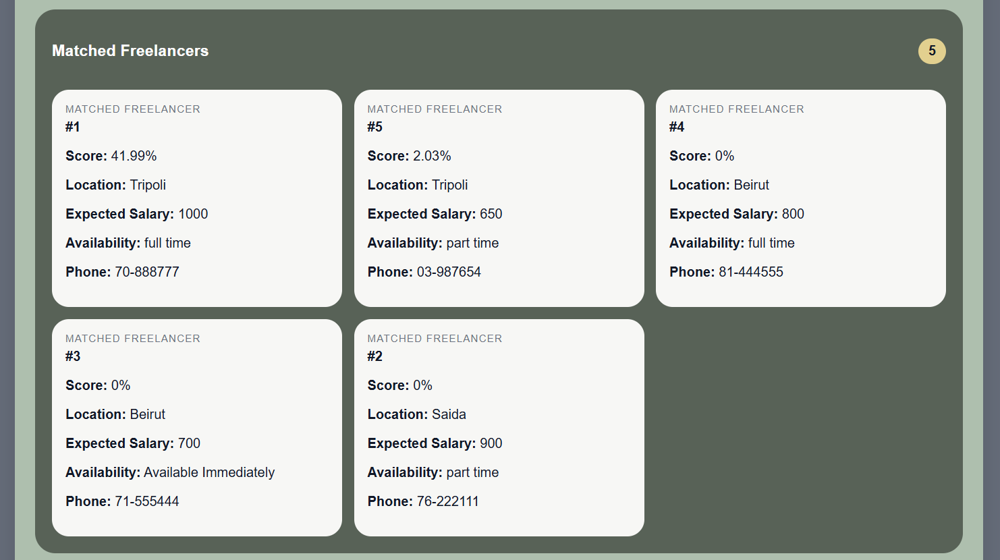
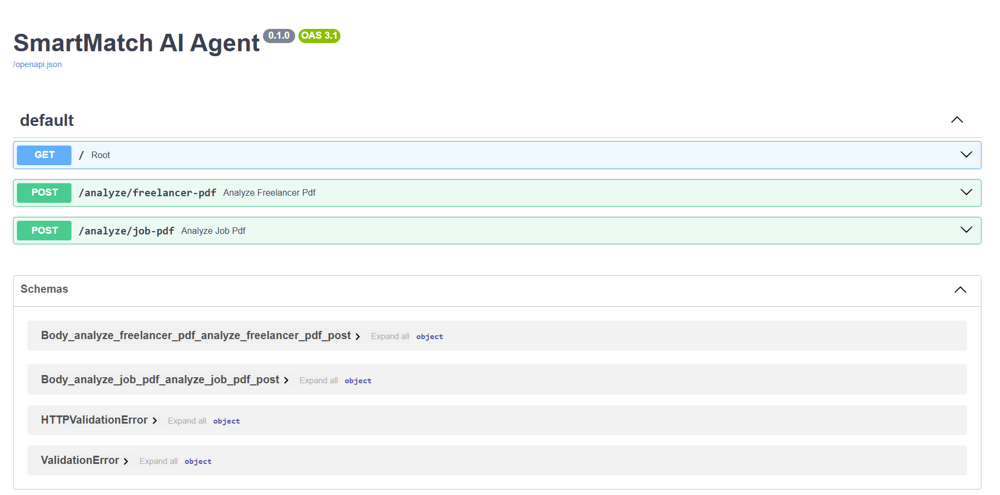

# SmartMatch AI

SmartMatch AI is a full-stack freelance matching platform that connects clients with suitable freelancers using AI-assisted PDF analysis and similarity scoring.

The platform supports two user roles:

- **Clients** can create jobs, upload job-requirement PDFs, review matched freelancers, and accept or reject applications.
- **Freelancers** can create profiles, upload experience or resume PDFs, view matched jobs, and apply to suitable opportunities.

## Key Features

- Client and freelancer authentication
- Role-based dashboards
- Client job posting
- Freelancer profile management
- Resume and job PDF upload
- PDF text extraction with PyMuPDF
- Skill extraction and text preprocessing
- TF-IDF vectorization
- Cosine-similarity match scoring
- Ranked job recommendations
- Ranked freelancer suggestions
- Job application management
- Accept, reject, and pending application statuses
- MySQL database integration
- REST API communication between frontend, backend, and AI service

## System Architecture

SmartMatch AI is organized into three main components:

1. **Frontend**  
   React application for login, signup, dashboards, profiles, job posting, matching results, and application management.

2. **Backend**  
   Node.js and Express REST API responsible for authentication, users, profiles, jobs, applications, file uploads, and MySQL integration.

3. **AI Agent**  
   FastAPI service that extracts text from PDF files and calculates matching scores using TF-IDF and cosine similarity.

## Technologies

### Frontend

- React
- JavaScript
- HTML
- CSS

### Backend

- Node.js
- Express.js
- MySQL
- REST APIs
- Multer
- CORS

### AI Agent

- Python
- FastAPI
- PyMuPDF
- scikit-learn
- TF-IDF
- Cosine Similarity
- MySQL Connector

## AI Matching Workflow

1. A client uploads a job-requirements PDF, or a freelancer uploads an experience PDF.
2. The AI service extracts text from the uploaded PDF.
3. The extracted text is cleaned and processed.
4. TF-IDF converts the job and freelancer text into numerical vectors.
5. Cosine similarity calculates a match score.
6. The platform ranks and displays the most relevant jobs or freelancers.

## Screenshots

### Login



### Client Dashboard

Clients can create job opportunities, define salary ranges and locations, and upload job-requirement PDFs.



### Freelancer Dashboard

Freelancers can enter salary expectations, availability, location, and upload an experience PDF.



### Profile Management

Users can update personal information, bio, contact details, location, and profile image.



### Job Applications

Clients can review applications and update each application status.



### Matched Jobs

Freelancers receive ranked job recommendations with AI-generated match scores.



### Matched Freelancers

Clients receive ranked freelancer suggestions with match scores and profile details.



### FastAPI Documentation

The AI service exposes endpoints for analyzing freelancer and job PDFs.



## Project Structure

```text
smartmatch-ai/
├── frontend/
│   ├── public/
│   ├── src/
│   ├── package.json
│   └── package-lock.json
│
├── backend/
│   ├── server.js
│   ├── package.json
│   ├── package-lock.json
│   └── .env.example
│
├── AI-agent/
│   ├── main.py
│   ├── requirements.txt
│   └── .env.example
│
├── screenshots/
├── .gitignore
└── README.md
```

## Prerequisites

Install the following software:

- Node.js
- Python 3
- MySQL or XAMPP
- Git

## Database Setup

1. Start Apache and MySQL from XAMPP.
2. Open phpMyAdmin.
3. Create a database named:

```text
smartmatch_ai
```

4. Import the project SQL schema and sample data.
5. Confirm that MySQL is running on port `3306`.

## Environment Configuration

Create a `.env` file inside the `backend` folder:

```env
DB_HOST=127.0.0.1
DB_PORT=3306
DB_USER=root
DB_PASSWORD=YOUR_MYSQL_PASSWORD
DB_NAME=smartmatch_ai
```

Create another `.env` file inside the `AI-agent` folder:

```env
DB_HOST=127.0.0.1
DB_PORT=3306
DB_USER=root
DB_PASSWORD=YOUR_MYSQL_PASSWORD
DB_NAME=smartmatch_ai
```

Do not upload `.env` files to GitHub.

## Run the Backend

```bash
cd backend
npm install
npm start
```

The backend runs on:

```text
http://localhost:8000
```

## Run the AI Agent

```powershell
cd AI-agent
py -m venv .venv
.\.venv\Scripts\Activate.ps1
python -m pip install -r requirements.txt
python -m uvicorn main:app --reload --port 9000
```

FastAPI documentation:

```text
http://127.0.0.1:9000/docs
```

## Run the Frontend

```bash
cd frontend
npm install
npm start
```

The frontend normally runs on:

```text
http://localhost:3000
```

If port 3000 is busy, React may start on port 3001.

## Author

**Ahmad Shaaban**  
Computer Science Graduate interested in Artificial Intelligence, Machine Learning, Natural Language Processing, and Software Development.

- GitHub: [ahmadshaaban394-cell](https://github.com/ahmadshaaban394-cell)
- LinkedIn: [Ahmad Shaaban](https://www.linkedin.com/in/ahmad-shaaban-17b675259)
